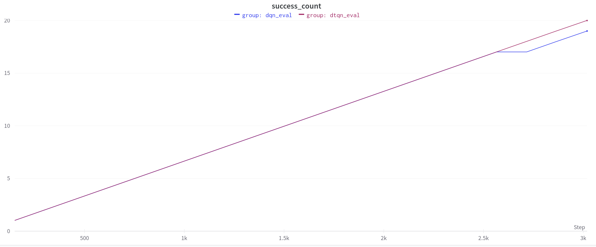
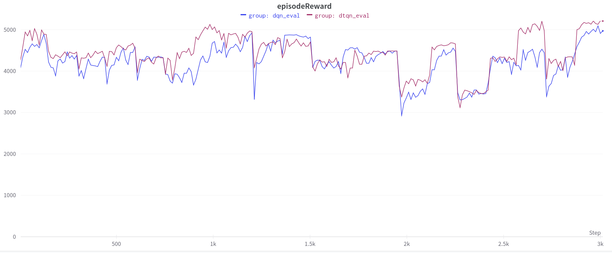
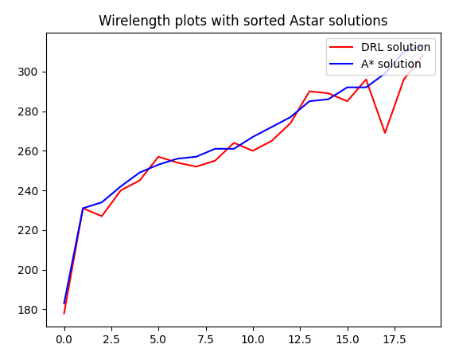
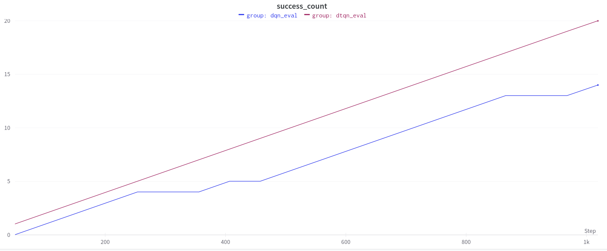
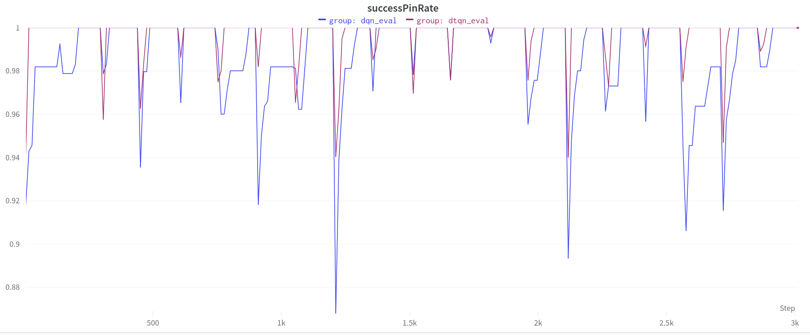
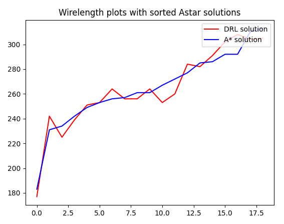

#  DTQN Global routing
In this repo, I used [Deep Transformer Q-Networks ](https://github.com/kevslinger/DTQN) to solve the Global routing problem, and found that dtqn can generalize better than DQN in the Global routing environment.   
The global routing benchmark generator is from the paper ["A Deep Reinforcement Learning Approach for Global Routing"](https://arxiv.org/pdf/1906.08809.pdf).     
Original implementation is in [this repo](https://github.com/haiguanl/DQN_GlobalRouting).

## scripts to generate data, training, and plot figures
```sh
python scripts/get_data_and_train.py
```
## Generate Dataset
To train the agent, first generate the train and eval dataset
```sh
# train data
python gen_data.py --benchmarkNumber 50 --gridSize 8 --netNum 20 --vCap 4  --hCap 4 --maxPinNum 5 --reducedCapNum 3 --prefix ./train_data_/
# test data
python gen_data.py --benchmarkNumber 20 --gridSize 8 --netNum 20 --vCap 4  --hCap 4 --maxPinNum 5 --reducedCapNum 3 --prefix ./test_data_/
```       
## start training 
default options is in configs.yaml, you can modify it directly or overwrite it through command line

args
- algos:str  ( algos name are all in Trainer/Router.py)
  - dqn, dtqn_noisy, dtqn_eps, dtqn_per_noisy
- wandbName:str
- hid_layer:int = 3
- emb_dim:int = 64
- context_len:int = 5
- early_stop:bool = False
- result_dir:str = solutionsDRL
```sh
python run.py --mode "train" --algos dtqn --run_benchmark_num=30
```
## start eval
```sh
python run.py --mode "eval" --algos dtqn
```

## Go to wandb site to check the result
dtqn (pink) can solve 20/20 pin problem in 150 episode,  
while dqn can only solve 19/20  




## plot wire len
```sh
cd eval
python Evaluation.py 
python VisualizeResults.py 
``` 
will generate wirelen images in ./eval/VisualizeResult.
 


### Differences from the original implementation
The [original implementation](https://github.com/haiguanl/DQN_GlobalRouting) used A* memory burn-in to speed up training.
This implementation didn't use memory burn-in technique for simplicity. 


## Compare DTQN with DQN
DTQN can model the stochastic and partially observable environment better than dqn, making the pretrain more robust.  
### Success count with 50 self-play budget 
dqn needs more self-play budget to connect two pin, making it perform worse than dtqn under lower self-play evaluation budget(50)
When self-play_episode_num is set to 50  
dqn can only complete 14/20 pin benchmarks,   
while dtqn can complete all 20/20 pin benchmarks.  
```sh
#pretrain
python run.py --mode "train" --algos dtqn||dqn --run_benchmark_num 30
#eval
python run.py --mode "eval" --algos dtqn||dqn --self_play_episode_num 50
``` 


### 150 self-play budget
#### success count
dqn performs better when self-play budget is higher(success count 19/20), but still cannot solve all problems
```sh
#eval
python run.py --mode "eval" --algos dtqn
python run.py --mode "eval" --algos dqn 
```  


#### success rate
dtqn can solve pin problem in smaller self-play number compare to dqn.  
  

   
#### espisode reward
dtqn have higher reward than dqn   


#### wire length
compare dqn wire length with A* algorithm (0.52 winning rate) (with 19/20 pins)



compare dtqn wire length with A* algorithm (0.7 winning rate) (with 20/20 pins)


## Todo
- Reward shaping for Overflow 
- merge rainbow into one file
- translate eval2008.pl to python
- json format for netlist
