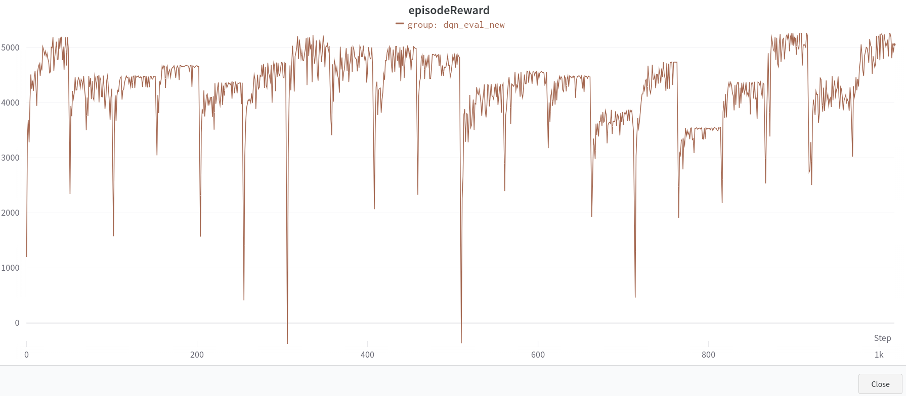
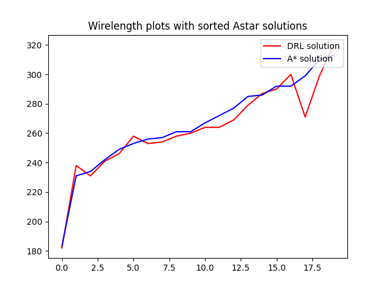
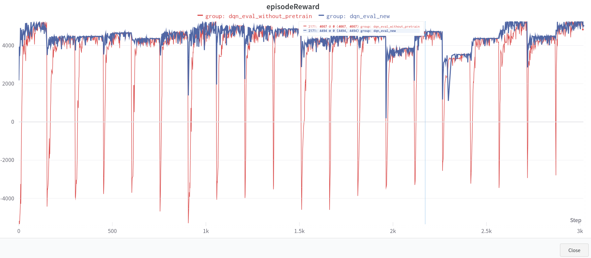
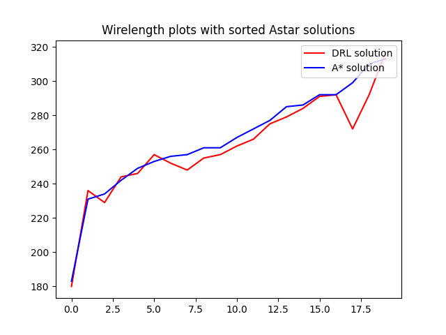

#  DQN Global routing torch
In this repo, I  reimplement [dqn global routing](https://github.com/haiguanl/DQN_GlobalRouting) in pytorch, and make the Q-network deeper to get better training results.    

### Differences from original implementation
- deeper network   
The [original implementation](https://github.com/haiguanl/DQN_GlobalRouting/blob/master/GlobalRoutingRL/DQN_Implementation.py) uses only three hidden layers, this implementation uses a deeper architecture similar to resnet  (in [Trainer/algos/agent/dqn.py](https://github.com/jaco267/DQN_Global_torch/blob/main/Trainer/algos/agent/dqn.py)) for better performance.    
- remove memory burn-in     
The original implemenation used A* memory burn-in to make the training faster, this implementation didn't used memory burn-in, but can still achieve 0.75  wire-length winning rate against A* algorithm. (with the help of deeper network) 
- pretrain stage
You can pretrain the agent to avoid training agent from scratch everytime in evaluation stage.


# How to run?
## Step0. Install packages
```sh
pip install -r requirements.txt
```
## Step1. Generate Dataset
To train the agent, first generate the train and eval dataset
```sh
# train data
python gen_data.py --benchmarkNumber 30 --gridSize 8 --netNum 20 --vCap 4  --hCap 4 --maxPinNum 5 --reducedCapNum 3 --prefix ./train_data_/
# test data
python gen_data.py --benchmarkNumber 20 --gridSize 8 --netNum 20 --vCap 4  --hCap 4 --maxPinNum 5 --reducedCapNum 3 --prefix ./test_data_/
```       

## Step2. start training 
default options is in configs.yaml (or Trainer/Router.py main_fn), you can modify it in yaml or overwrite it through command line interface

command line (or yaml) args
- mode:str = 'train' || 'eval'
- algos:str  ( algos names are the filenames in Trainer/algos/agent folder)
  - dqn, dtqn, rainbow_dqn
- wandbName:str
- hid_layer:int = 3
- emb_dim:int = 64
- context_len:int = 5
- early_stop:bool = False
- result_dir:str = solutionsDRL
- load_ckpt:bool
- save_ckpt:bool
- self_play_episode_num:int -> self play budget
- enable_wandb:bool=True -> use wandb for plotting
- data_folder:str -> netlist data to solve
```sh
python run.py --mode "train" --algos dqn --run_benchmark_num 30
```
## Step3. start eval
eval run the 20 test benchmark, each with 150 self-play number (in configs.yaml),
eval will take longer time to run (about 2hr on a RTX3060 GPU)
```sh
python run.py --mode "eval" --algos dqn --self_play_episode_num 150
```

## Step4. Go to wandb site to check the result



## Step5. plot wire len
```sh
cd eval
python Evaluation.py 
python VisualizeResults.py 
``` 
will generate wirelen images in ./eval/VisualizeResult.      
    
Compare dqn wire length with A* algorithm (0.75 winning rate) (lower is better)    



### Without pretrain model
Evalutaion with out pretrain model will get similar result, compare with evalutation with pretrain model (~=0.75 winning rate), but will takes a longer time to train.   
```sh
# fist delete the pretrain model -->  model/dqn.ckpt
# train from scratch   
python run.py --mode "eval" --algos  dtqn --self_play_episode_num 150
```
 

#### wire len without pretrain

 

#### Training  time
Training time on a Nvidia 3060 GPU    
- without pretrain 110min
- pretrain 60min

### other algorithms
#### DTQN
To run [Deep Transformer Q-Networks ](https://github.com/kevslinger/DTQN), change the algos option through command line.          
      
```sh
## pretrain
python run.py --mode "train" --algos dtqn --run_benchmark_num 30
## eval
python run.py --mode "eval" --algos  dtqn --self_play_episode_num 150
```
##### DTQN result
dtqn has similar results compare to dqn.      
      
compare dtqn wire length with A* algorithm (0.7 winning rate)


<!-- #### rainbow 
In the current setting, only double dqn can improve the performance.
```sh
python run.py --mode "train" --algos rainbow_dqn --enable_wandb True --rainbow_mode double,nstep 
python run.py --mode "eval" --algos rainbow_dqn --enable_wandb True --rainbow_mode double,nstep   
``` -->

<!-- ## Todo
- Reward shaping for Overflow 
- merge rainbow into one file
- translate eval2008.pl to python
- json format for netlist -->