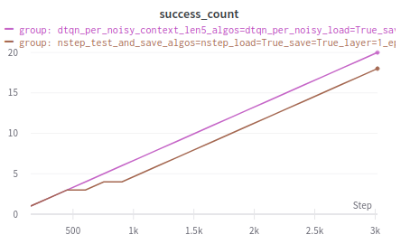
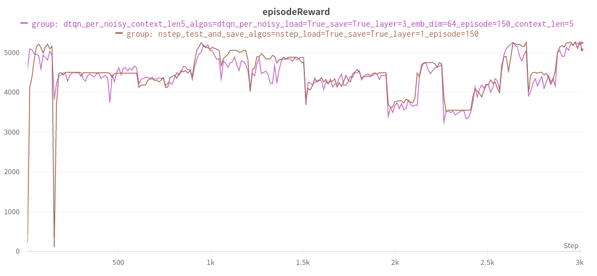
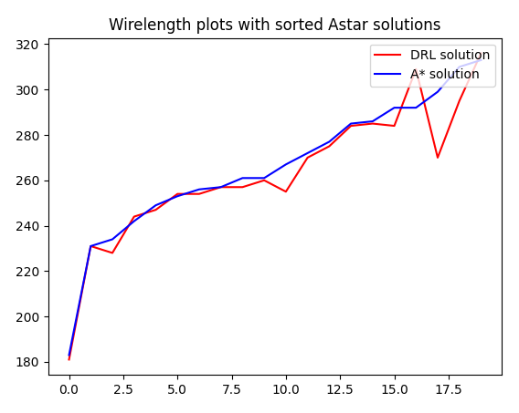

###  DTQN Global routing
In this repo, I used [Deep Transformer Q-Networks ](https://github.com/kevslinger/DTQN) to solve the Global routing problem, and found that dtqn can generalize better than DQN in the Global routing environment.   
The global routing benchmark generator is from the paper ["A Deep Reinforcement Learning Approach for Global Routing"](https://arxiv.org/pdf/1906.08809.pdf).     
Original implementation is in [this repo](https://github.com/haiguanl/DQN_GlobalRouting).
### Compare DTQN with DQN
DTQN can model the stochastic and partially observable environment better than dqn, making the pretrain more robust.

## Generate Dataset
To train the agent, first generate the train and eval dataset
```sh
# train data
python gen_data.py --benchmarkNumber 5 --gridSize 8 --netNum 20 --vCap 4  --hCap 4 --maxPinNum 5 --reducedCapNum 3 --prefix ./train_data_/
# test data
python gen_data.py --benchmarkNumber 20 --gridSize 8 --netNum 20 --vCap 4  --hCap 4 --maxPinNum 5 --reducedCapNum 3 --prefix ./test_data_/
```       
## start training 
run.py is just a wrapper for train.py with some default options in configs.yaml
- algos  ( algos name are all in Trainer/Router.py)
  - dqn
  - dtqn_noisy
  - dtqn_eps
  - dtqn_per_noisy
```sh
python run.py --mode "train" --algos dtqn_noisy --enable_wandb True --run_benchmark_num=30 --wandbName Train
# this is equivalent to
# python train.py --algos=dtqn_noisy --self_play_episode_num=4 --result_dir=solutionsDRL --load_ckpt=True --save_ckpt=True  --data_folder="train_data_/benchmark_reduced" --wandbName="dtqn_per_noisy_train" --hid_layer=3 --emb_dim=64 --context_len=5
```
## start eval
```sh
python run.py --mode "eval" --algos dtqn_noisy --wandbName Eval
# this is equivalent to 
# python train.py --algos=dtqn_noisy --self_play_episode_num=150 --result_dir=solutionsDRL --load_ckpt=True --save_ckpt=False  --data_folder="test_data_/benchmark_reduced" --wandbName="dtqn_per_noisy_context_len5" --hid_layer=3 --emb_dim=64 --context_len=5 
```

## Go to wandb site to check the result
dtqn (pink) can solve 20/20 pin problem in 150 episode,  
while dqn can only solve 18/20  




## wirelength
### dtqn vs A* solution



### Compare with original implementation
The [original implementation](https://github.com/haiguanl/DQN_GlobalRouting) used A* memory burn-in to speed up training.
This implementation didn't use memory burn-in technique for simplicity. 